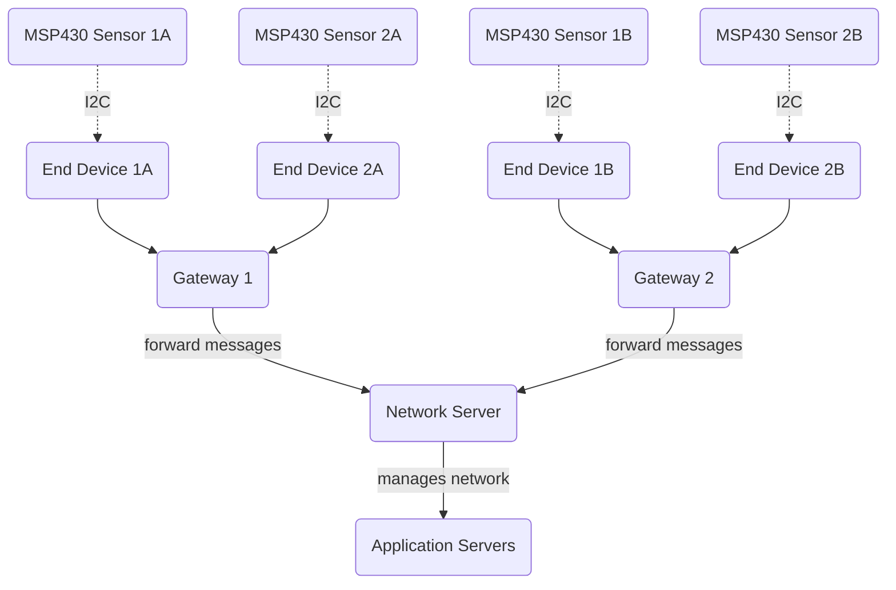

# sensor-network

## Introduction

End Devices - sensors or actuators send LoRa modulated wireless messages to the gateways or receive messages wirelessly back from the gateways. .

Gateways - receive messages from end devices and forward them to the Network Server.

Network Server - a piece of software running on a server that manages the entire network.

Application servers - a piece of software running on a server that is responsible for securely processing application data.

https://www.thethingsnetwork.org/docs/lorawan/lorawan-relay/

## Relay

LoRaWAN relays are suitable for bridging wireless communication gaps in areas where the gateway and end device cannot directly communicate with each other due to weak signal strength caused by factors such as extreme distance or obstacles between them. They are low-cost, low-power devices. A relay’s hardware is equivalent to a standard LoRaWAN end device. A single relay can serve up to 16 end devices. For the Network Server, a relay appears as a standard end device.

Gateways are the same as end devices, but they are connected to the network server and maybe on hardwired connections for power and connection to the network server. They are responsible for forwarding messages from end devices to the network server.